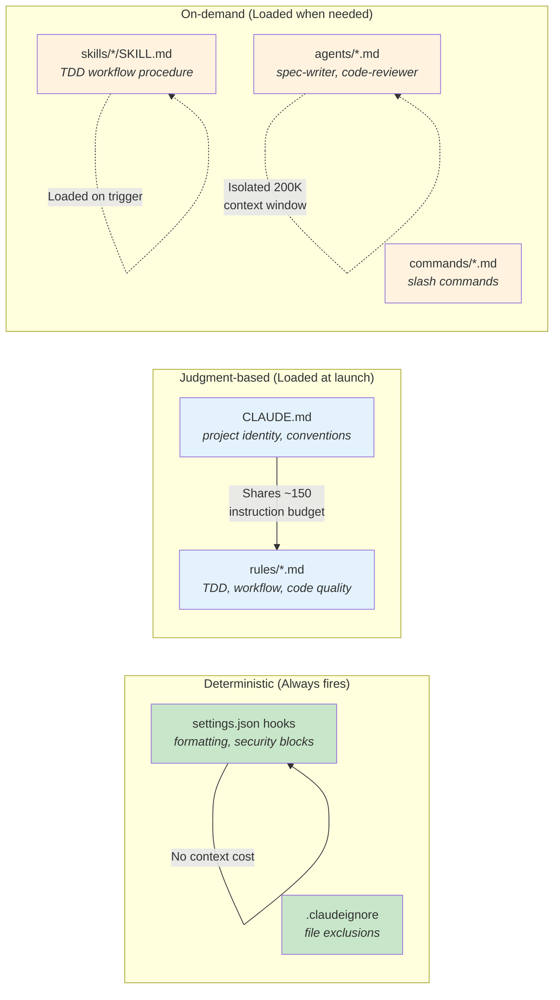

# Configuration Layers

## What goes where



**The principle:** Use hooks for things that must ALWAYS happen (formatting, security). Use rules and CLAUDE.md for things requiring judgment (coding patterns, conventions). Use skills/agents for workflows that only activate sometimes. See `hooks.md` for the deterministic-first hierarchy.

## Hooks (`.claude/hooks/`)

Hook scripts live in `.claude/hooks/` and are referenced from `settings.json`. They receive JSON on stdin and control behavior via exit codes.

| Hook | Event | Script | What it does |
|------|-------|--------|-------------|
| File protection | PreToolUse (Write\|Edit\|MultiEdit) | `protect-files.sh` | Blocks writes to `.env`, credentials, `foundations.md`, `node_modules/`, `dist/`, `generated/` |
| Syntax lint | PostToolUse (Write\|Edit\|MultiEdit) | `lint-on-write.sh` | Validates syntax: bash -n for .sh, jq for .json, yaml check for .yaml. Blocks on errors. |
| Auto-format | PostToolUse (Write\|Edit\|MultiEdit) | `format-on-write.sh` | Runs project formatter (uncomment for your stack: Prettier, Black, gofmt, etc.) |

## Rules (loaded at launch)

| Rule file | Concern | Key behaviors enforced |
|-----------|---------|----------------------|
| `deterministic-first.md` | Architecture | Use scripts/hooks over Claude reasoning for computable operations; hierarchy: hook → script → slash command → pure reasoning |
| `tdd.md` | Testing | Red-green-refactor cycle, test naming, fix implementation not tests |
| `workflow.md` | Sessions | One objective per session, `/stasis` before `/compact`, delegate research, stop after 2 failures |
| `code-quality.md` | Code | Follow existing patterns, typed errors, pin dependencies, intent-revealing names |
| `tls-troubleshooting.md` | Certs | Auto-detect WARP cert errors, fix with CA bundle, never disable TLS |
| `self-review.md` | Meta | Flag stochastic interventions during stasis runs and reviews; lightweight always-on version of `/ccanvil-audit` |

### Rule frontmatter (BTS-385)

Rule files MAY declare top-level frontmatter peer to the existing `manifest:` block:

```yaml
---
tier: 0          # 0 = atom (always-on, ≤150 token target); 1 = skill; 2 = reference
scope: universal # universal | substrate | hub-only (composes with BTS-384 distribution filter)
stack: any       # any | bats | jest | pytest | ... (composes with ccanvil.json stacks declaration)
anchors:
  apply: []          # skill paths to load when applying the rule (Tier-1)
  evidence: []       # reference docs explaining rationale + war stories (Tier-2)
  related-rules: []  # peer rule files
manifest:
  ...                # existing manifest block (drift-detection)
---
```

Atomized rules trim the body to the directive layer and route operational detail to the `anchors.evidence` reference doc. Files without frontmatter default to `tier=0 scope=universal stack=any anchors={}` (back-compat preserved).

Resolve a rule's bundle: `bash docs-check.sh rule-resolve <rule-id> --project-dir .` returns `{rule, tier, scope, stack, anchors, body_path}`.

**Validator behavior (BTS-386).** `bash module-manifest.sh validate --json` scans `.claude/rules/*.md` and emits:

- `info[].rule-tier-budget-exceeded` — tier-0 rule whose whole-file token estimate (char-count / 4) exceeds 150. Advisory only; status stays `ok` (so existing consumers don't see false-alarm drift). Exit 0 by default; `--strict` flag escalates to exit 2.
- `drift[].rule-frontmatter-malformed` — rule with malformed YAML frontmatter. Block-shape: always exit 2 with status=`drift`.
- `info[].frontmatter-missing` — rule without frontmatter. Advisory only; the validator continues with the back-compat default envelope.

The `info` array is always present in the JSON envelope (empty when no info entries). Status is `drift` only when block-shape entries exist in `drift[]`; warn-shape signal lives in `info[]` and is the discoverable "atomization needed" list without blocking PR finalize.

### Stacks declaration (BTS-385)

`.claude/ccanvil.json` accepts a top-level `stacks:` array declaring the project's tech stacks (e.g. `["bats"]`, `["jest", "playwright"]`, `["pytest"]`). Defaults to `["any"]` when absent. Future Tier-1 skill loaders will use this to conditionally load stack-specific skills (`tdd-bats`, `tdd-jest`, etc.) — the field is declarative for now; substrate enforcement ships in a follow-up.

### Hub describes behavior, node describes implementation (BTS-460)

Hub-shipped rules, skills, and hooks describe *behavior* (run the test suite, check the lint, etc.); node-local config (`.claude/ccanvil.json`) describes *implementation* (which tool actually runs). A substrate dispatcher reads the config and forwards to the right runner. This keeps the same hub content working correctly across bats / pytest / vitest / jest / go nodes without per-node forks or tool names leaking through universal rules.

**First concrete instance — test-suite dispatch:**

`.claude/ccanvil.json` accepts an optional top-level `test-provider:` string (`bats`, `pytest`, `vitest`, `jest`, `go`, ...). Resolution order: explicit `test-provider`, then `stacks[0]`, then literal default `bats`.

```jsonc
{
  "test-provider": "bats",       // optional — explicit wins
  "stacks": ["bats"]              // fallback when test-provider absent
}
```

Hub rule cites the verb, not the tool:

```
Run `bash .ccanvil/scripts/docs-check.sh test-suite-run --project-dir . --parallel --progress`.
```

Dispatcher (`cmd_test_suite_run` in `docs-check.sh`) resolves the provider and exec's the runner. Today only `bats` is implemented (`exec bash bats-report.sh ...`); other providers exit 2 with an explicit `dispatcher not yet implemented` message — the contract is intentionally fail-loud so missing implementations surface at /pr time rather than silently no-op'ing.

**Leak-site inventory (captured follow-up).** As of BTS-460's ship, the following hub-shared content still references tool names directly. Each is a candidate for the same indirection treatment when the friction surfaces:

- `.claude/rules/tdd.md` — bats-specific verbiage (`strict-mode bats`, `bats-report.sh`). Indirect via `test-provider` or rewrite to "the project's test runner".
- `.claude/skills/stasis/SKILL.md` — line 131 hardcodes `bats-report.sh --parallel` for the post-stasis tests count. Migrate to the dispatcher.
- `.ccanvil/guide/command-reference.md` — bats-specific entries for `bats-report.sh` / `bats-lint.sh`. Keep as-is for hub developers; downstream consumption is mediated by skills.

Other axes that may want the same dispatcher pattern (when friction surfaces, not before): linter, formatter, package manager, build tool.

<!-- NODE-SPECIFIC-START -->
<!-- Add project-specific content below this line. -->
<!-- Hub content above is updated via /ccanvil-pull. -->
