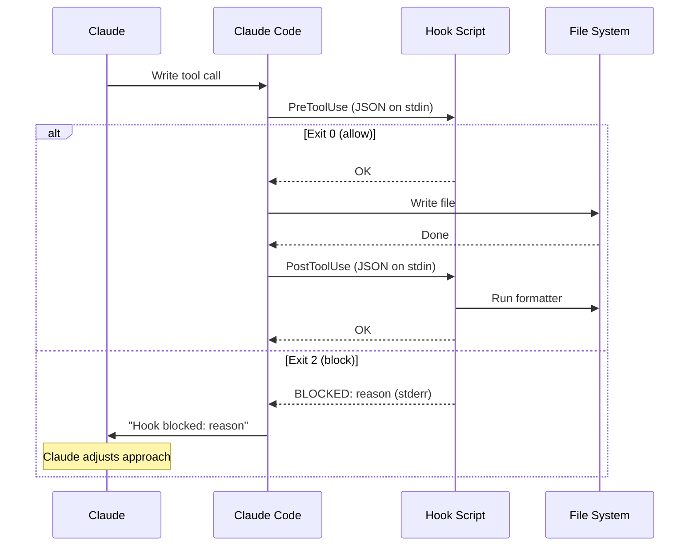
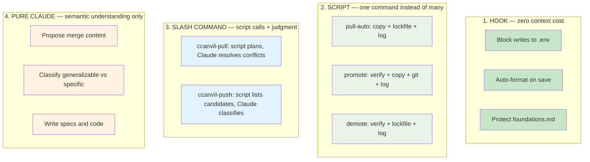

# Hooks System

Hooks are deterministic automation that runs at Claude Code lifecycle events — outside the reasoning loop, at zero context cost. They are the foundation of the deterministic-first principle.

> **Reference:** See `.ccanvil/templates/hooks-reference.md` for the complete hook specification including JSON schemas, all event types, and writing conventions.

## How Hooks Work

## Deterministic-First Principle

Every operation falls somewhere on the deterministic-stochastic spectrum. The preset system enforces this hierarchy:

**The test:** "Can this step produce a wrong answer?" If no → it belongs in a script or hook, not Claude's reasoning.

## Hook vs Rule vs Skill

| Situation | Mechanism | Why |
|-----------|-----------|-----|
| "Never write to .env files" | **Hook** (PreToolUse, exit 2) | Binary file path check, zero context cost |
| "Always format code after writing" | **Hook** (PostToolUse) | Deterministic formatter, zero context cost |
| "Protect foundations.md" | **Hook** (PreToolUse, exit 2) | Binary check, enforced even if Claude forgets the rule |
| "Follow existing code patterns" | **Rule** | Requires semantic understanding of codebase |
| "Don't add unnecessary dependencies" | **Rule** | Requires judgment about "unnecessary" |
| "Run TDD red-green-refactor cycle" | **Skill** | Multi-step workflow with verification |

## Active Hooks

| Script | Event | Exit 2 blocks | What it checks |
|--------|-------|---------------|----------------|
| `protect-files.sh` | PreToolUse | Yes | `.env`, `*credentials*`, `*secret*`, `*.pem`, `*.key`, `foundations.md`, `node_modules/`, `dist/`, `generated/`, `.git/` |
| `guard-destructive.sh` | PreToolUse (Bash) | Yes | `git reset --hard`, `git branch -D`, `git push --delete`, `git clean -f`, `chmod 777/666/000`, `rm -rf` (recursive+force, any flag form), `find -delete` / `find -exec` / `-execdir` / `-okdir`. Bypass: prefix with `ALLOW_DESTRUCTIVE=1`. |
| `guard-workspace.sh` | PreToolUse (Bash) | Yes | Blocks gated verbs (`rm`/`cp`/`mv`/`chmod`/`chown`/`bash`/`find`/`sort`/`cat`) when any absolute or `~/`-prefixed path argument falls outside `$HOME/projects/` or whitelisted system temp dirs. Bypass: prefix with `ALLOW_OUTSIDE_WORKSPACE=1`. BTS-169: pure-slash tokens (`//`, `///`, ...) are exempted from the path scan to avoid false-positives on jq's `//` alternative-default operator. |
| `lint-on-write.sh` | PostToolUse | Yes | Syntax validation: `bash -n` for `.sh`, `jq empty` for `.json`, python yaml check for `.yaml`. Blocks writes with syntax errors. |
| `format-on-write.sh` | PostToolUse | No | Detects file type, runs appropriate formatter (uncomment for your stack) |
| `permission-request-suppress-redundant.sh` | PermissionRequest (Bash) | No (intercepts) | BTS-150: when a Bash command request is already covered by a broader allow pattern in `.claude/settings.json` (e.g., `Bash(bash:*)` covers `bash some-script.sh`), auto-allows with `destination: "session"` so the redundant exact-form never persists to `.claude/settings.local.json`. Suppresses upstream drift that BTS-144's `promote-review` classifier and BTS-149's `/permissions-review` clean up periodically. Pattern shapes: token-prefix `Bash(<bin>:*)`, path-prefix `Bash(<dir>/:*)`, exact `Bash(<form>)`. Non-Bash tools and uncovered commands are passthrough. |
| `session-boundary.sh` | SessionStart | No | BTS-206: bumps `.ccanvil/state/session-counter` (atomic int increment) and stamps `.ccanvil/state/session-boundary` with `{epoch, iso, tz}` JSON on every fresh session start. ISO-8601 local timestamp uses TZ env or `/etc/localtime` symlink (fallback `UTC`). Surfaced by `/stasis` (metadata `> Session: N`, `> Boundary: <iso>`) and `/recall` briefing. All write failures log WARN and exit 0 — never blocks session start. Counter corruption (non-integer file content) resets to 1 with a WARN. |

## Adding a New Hook

1. Create script in `.claude/hooks/` (use `protect-files.sh` as template)
2. `chmod +x .claude/hooks/my-hook.sh`
3. Add entry to `.claude/settings.json` under the appropriate event
4. Test: `echo '{"tool_input":{"file_path":"test.env"}}' | .claude/hooks/my-hook.sh; echo "exit: $?"`
5. Update this section and `.ccanvil/templates/hooks-reference.md`

<!-- NODE-SPECIFIC-START -->
<!-- Add project-specific content below this line. -->
<!-- Hub content above is updated via /ccanvil-pull. -->
