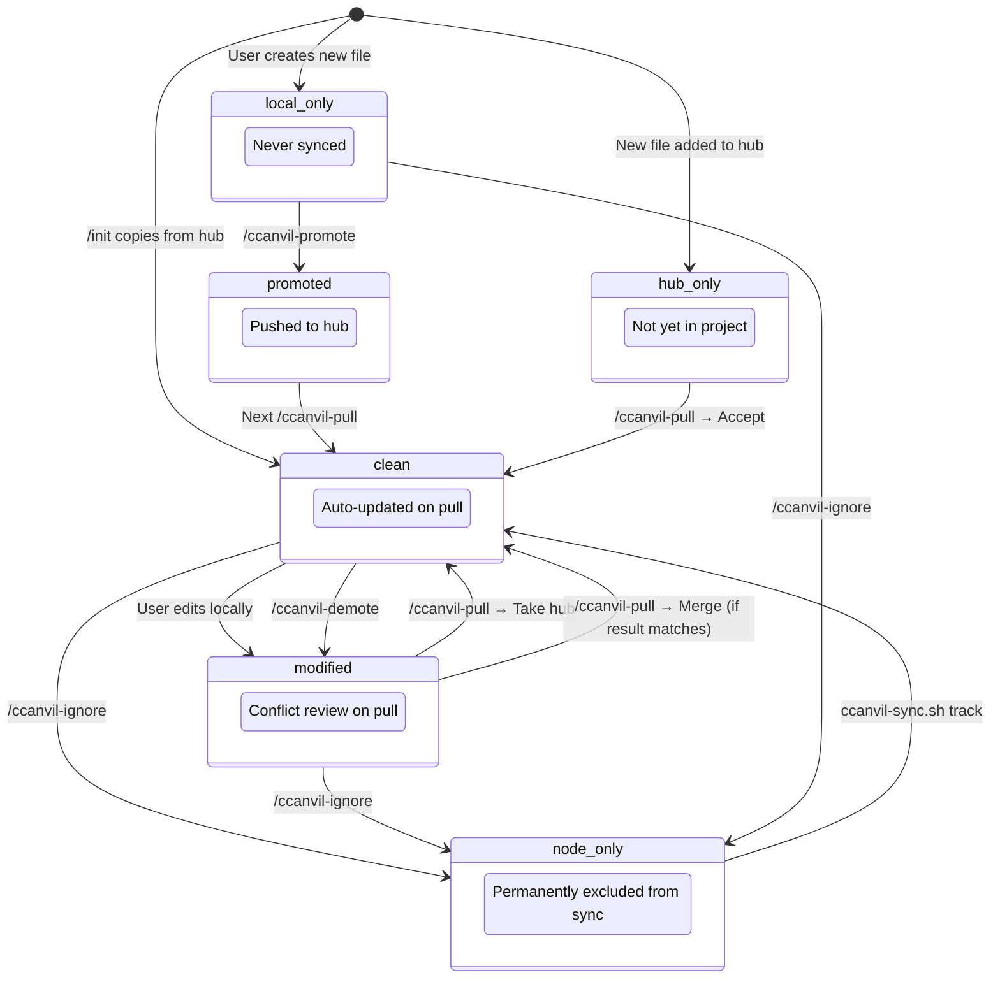
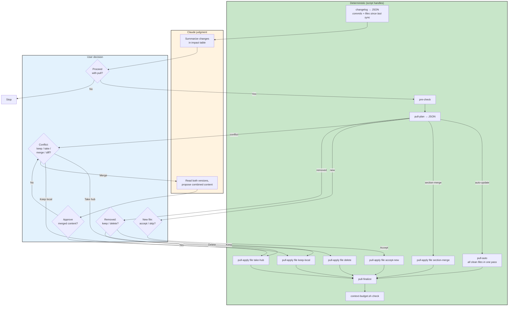
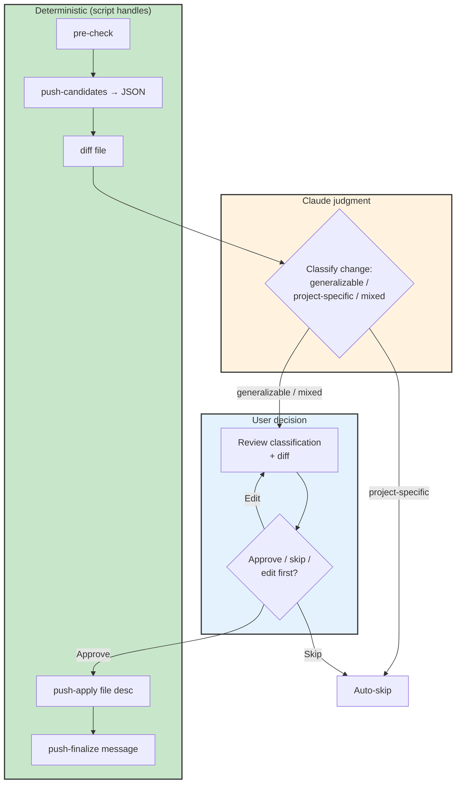
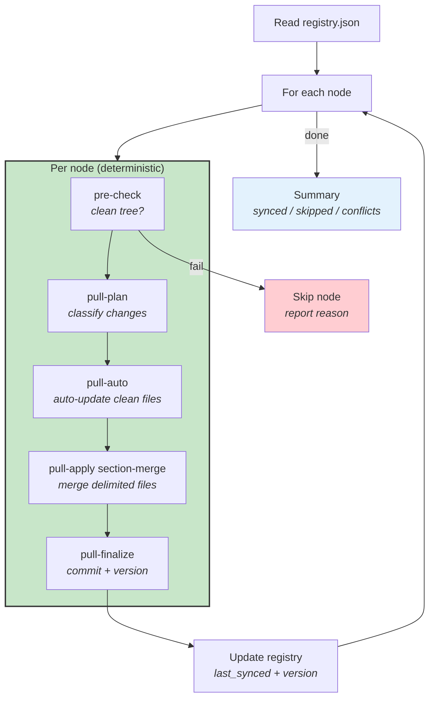
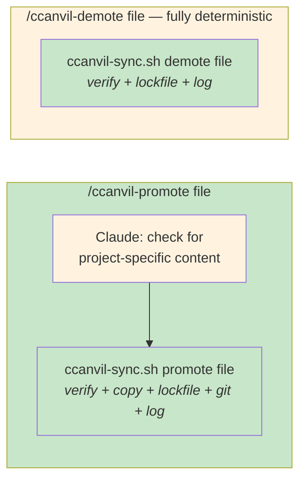
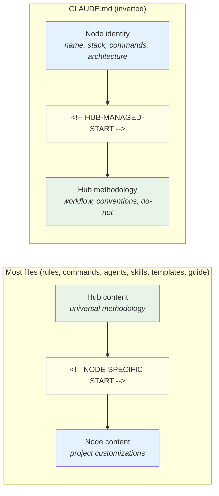

# Sync System

The hub has downstream project nodes. The sync system enables bi-directional flow of configuration.

## Architecture

```mermaid
graph TB
    subgraph HUB["Hub<br/>~/projects/ccanvil"]
        H_RULES["rules/"]
        H_CMD["commands/"]
        H_AGENTS["agents/"]
        H_SKILLS["skills/"]
        H_TEMPLATES[".ccanvil/templates/"]
        H_SCRIPTS["scripts/"]
        H_GUIDE[".ccanvil/guide/<br/><i>hub sections</i>"]
        H_CLAUDE["CLAUDE.md<br/><i>hub methodology</i>"]
        H_FRAMEWORK[".ccanvil/guide/foundations.md<br/><i>research — read-only</i>"]
    end

    subgraph NODE["Downstream Project (e.g. fucina)"]
        N_RULES["rules/<br/><i>global + local</i>"]
        N_CMD["commands/<br/><i>global + local</i>"]
        N_AGENTS["agents/"]
        N_SKILLS["skills/"]
        N_TEMPLATES[".ccanvil/templates/"]
        N_SCRIPTS["scripts/"]
        N_GUIDE[".ccanvil/guide/<br/><i>hub + node sections</i>"]
        N_CLAUDE["CLAUDE.md<br/><i>node identity + hub methodology</i>"]
        N_FRAMEWORK[".ccanvil/guide/foundations.md<br/><i>read-only copy</i>"]
        LOCK[".claude/ccanvil.lock<br/><i>provenance manifest</i>"]
    end

    H_RULES <-->|"sync"| N_RULES
    H_CMD <-->|"sync"| N_CMD
    H_AGENTS <-->|"sync"| N_AGENTS
    H_SKILLS <-->|"sync"| N_SKILLS
    H_TEMPLATES <-->|"sync"| N_TEMPLATES
    H_SCRIPTS <-->|"sync"| N_SCRIPTS
    H_GUIDE -->|"section-merge"| N_GUIDE
    H_CLAUDE -->|"section-merge"| N_CLAUDE
    H_FRAMEWORK -->|"auto-update"| N_FRAMEWORK

    LOCK -.->|"tracks state"| N_RULES
    LOCK -.->|"tracks state"| N_CMD

    style HUB fill:#e8f4e8,stroke:#333,stroke-width:2px
    style NODE fill:#e3f2fd,stroke:#333,stroke-width:2px
    style LOCK fill:#f3e5f5
    style H_GUIDE fill:#fff3e0
    style H_CLAUDE fill:#fff3e0
    style H_FRAMEWORK fill:#e0e0e0
    style N_GUIDE fill:#fff3e0
    style N_CLAUDE fill:#fff3e0
    style N_FRAMEWORK fill:#e0e0e0
```



## File Status Lifecycle

Every tracked file has a status in the lockfile. Status determines what happens during pull/push.



## Pull Flow (Hub → Project)

Every step is handled by a script command except conflict merge proposals and the impact summary, which require Claude's semantic understanding.

The flow starts with a **pre-pull assessment** (`changelog`) that shows what changed and asks for confirmation before modifying any files.



**Bootstrap requirement:** The pull process uses `ccanvil-sync.sh` itself. If the hub has a newer version of the script with new commands, the node's old script won't know them. `pre-check` handles this automatically — it compares script hashes and copies the newer version before proceeding.

## Migrate vs Pull — When to Use Each

**Pull (`/ccanvil-pull`) is the default for ALL updates.** It detects changes, classifies them, and asks for resolution on conflicts. Non-delimited files with local modifications are flagged for review — nothing is silently overwritten.

**Migrate (`ccanvil-sync.sh migrate`) is destructive.** It copies ALL hub files unconditionally. For delimited `.md` files it section-merges (preserving node content), but for non-delimited files (scripts, JSON, hooks) it overwrites without checking for local modifications.

| Scenario | Use | Why |
|----------|-----|-----|
| Hub shipped new features, node needs them | **Pull** | Detects conflicts, preserves local changes |
| Node has been running for a while, routine sync | **Pull** | Safe, surgical, reviewable |
| Brand-new project, first-time ccanvil setup | **Init** (`/init` with preflight) | Preflight detects conflicts if files exist |
| Major structural change (e.g., rename across all files) | **Migrate** | Bulk reset when the delta is too large for pull |
| Node is corrupted or needs factory reset | **Migrate** | Intentional full overwrite |

**Never use migrate as a shortcut for pull.** If you're unsure, run `pull-plan` first to see what changed — it's read-only and shows you the full picture before any files are touched.

## Push Flow (Project → Hub)

Every step is handled by a script command except change classification, which requires Claude's semantic understanding.



## Broadcast (Hub → All Nodes)

`ccanvil-sync.sh broadcast` pushes hub updates to every registered downstream node in one pass. It runs only the deterministic phases — conflicts are collected and reported, not resolved.



| Flag | Effect |
|------|--------|
| `--dry-run` | Runs full broadcast without modifying files in any node |
| *(none)* | Applies auto-updates and section-merges, commits per node |

Conflicts (files needing Claude judgment) are reported at the end. Run `/ccanvil-pull` in the specific project to resolve them.

## Sync Hardening: Guards and Dry-Run

Every destructive operation in the sync system is self-validating. Guards verify preconditions immediately before execution; `--dry-run` previews changes without applying them.

### Guards (exit code 3)

| Guard | Trigger | What it prevents |
|-------|---------|-----------------|
| **jq validation** | After every lockfile mutation | Corrupt JSON replacing valid lockfile |
| **Hash re-check** | `pull-apply` with `PLAN_LOCAL_HASH` env var | File modified between plan and apply phases |
| **Status re-check** | `pull-apply delete` with `PLAN_LOCAL_STATUS` env var | Deleting file whose status changed since plan |
| **Commit verification** | `pull-finalize`, `push-finalize` | Silent commit failure (HEAD unchanged) |

All guards produce: `GUARD_FAIL: <operation> on <file>: <reason>` on stderr, exit code 3.

### Dry-run mode

| Command | Flag | What it shows |
|---------|------|--------------|
| `pull-auto --dry-run` | `--dry-run` | Files that would be copied |
| `pull-apply <file> <action> --dry-run` | `--dry-run` | Action that would be applied |
| `pull-finalize --dry-run` | `--dry-run` | Commit message and file list |
| `push-apply <file> --dry-run` | `--dry-run` | File that would be pushed |
| `push-finalize <msg> --dry-run` | `--dry-run` | Commit message |

Dry-run output uses prefix: `DRY-RUN: would <verb> <file>`. Pre-check still runs (cleanness verification is not skipped).

## Promote and Demote

Demote is fully deterministic. Promote has one judgment call: checking for project-specific content.



## Universal Delimiters (Section-Merge)

**Principle:** Every synced markdown file ships with a `<!-- NODE-SPECIFIC-START -->` delimiter. Hub content lives above the delimiter, node-specific customizations live below. This enables section-merge on pull — hub updates flow automatically without overwriting project customizations.

### Which files have delimiters

| Component type | Files | Delimiter | Hub section | Node section |
|----------------|-------|-----------|-------------|--------------|
| Rules | `.claude/rules/*.md` (5 files) | `NODE-SPECIFIC-START` | Universal principles, anti-patterns | Project-specific exceptions, local conventions |
| Commands | `.claude/commands/*.md` (10 files) | `NODE-SPECIFIC-START` | Workflow steps, script calls, universal rules | Project-specific paths, tools, additional steps |
| Agents | `.claude/agents/*.md` (3 files) | `NODE-SPECIFIC-START` | Role definition, output format, universal rules | Project-specific context, domain knowledge |
| Skills | `.claude/skills/*/SKILL.md` (1 file) | `NODE-SPECIFIC-START` | Methodology, phases, rules | Project test command, framework config |
| Templates | `.ccanvil/templates/*.md` (4 files) | `NODE-SPECIFIC-START` | Document structure, required sections | Project-specific fields, custom sections |
| Guide files | `.ccanvil/guide/*.md` | `NODE-SPECIFIC-START` | Documentation, diagrams, tables | Project-specific features |
| CLAUDE.md | `CLAUDE.md` | `HUB-MANAGED-START` | Workflow, conventions, do-not rules | Project name, tech stack, commands, architecture |

**What does NOT get delimiters (and why):**

| Component type | Why not | Alternative |
|----------------|---------|-------------|
| Scripts (`*.sh`) | Can't splice bash — functions depend on each other. HTML comments aren't valid bash. | Whole-file tracked. Node customization via separate scripts or node-only fork. |
| Hooks (`*.sh`) | Same as scripts. | Stack hooks: hub provides universal hooks, node adds additional hook entries in settings.json. |
| `settings.json` | JSON has no comments. | Node-only. Hub hook scripts sync; settings.json references are node-managed. |
| `foundations.md` | Research source material — identical everywhere, no node content. | Whole-file auto-update. |

### How section-merge works

Files with delimiters have a hub-managed section and a node-specific section. During `/ccanvil-pull`, the hub section is updated from the hub while the node section is preserved intact.



**During `/ccanvil-pull`:**
- **Files with `NODE-SPECIFIC-START`:** Hub section (above delimiter) is replaced with the hub's version. Node section (below) is untouched.
- **CLAUDE.md** (`HUB-MANAGED-START`): Node section (above delimiter) is untouched. Hub section (below) is replaced with the hub's version.
- **foundations.md:** Auto-updated as a whole file (no delimiter, no node content).

**During `/ccanvil-push`:** Node sections are always classified as project-specific and never pushed upstream.

**Legacy projects without delimiters:** The `section-merge` command gracefully handles files that don't have a delimiter yet — it treats the entire local file as node content and adds the hub section from the hub.

### Creating new markdown components

When adding a new rule, command, agent, skill, or template to the hub, **always** include the delimiter at the end:

```
<!-- NODE-SPECIFIC-START -->
<!-- Add project-specific content below this line. -->
<!-- Hub content above is updated via /ccanvil-pull. -->
```

<!-- NODE-SPECIFIC-START -->
<!-- Add project-specific content below this line. -->
<!-- Hub content above is updated via /ccanvil-pull. -->
