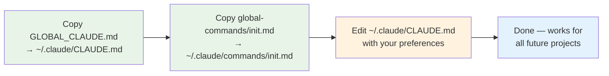
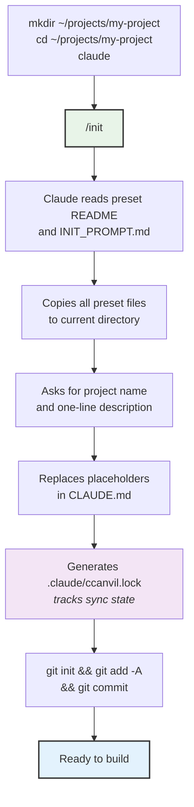

# Getting Started

## First-time setup (once per machine)



## Starting a new project



## Conventions for your CLAUDE.md

After `/init`, add project-specific conventions to the node section of CLAUDE.md (above `<!-- HUB-MANAGED-START -->`). Examples for common stacks:

**TypeScript/Node.js:**
```markdown
## Conventions
- API responses use shape: `{ success: boolean, data?: T, error?: string }`
- No barrel exports (index re-exports). Import directly from the source file.
- Environment variables: typed in a dedicated config module, never accessed raw.
- Do not suppress type errors — fix the types.
```

**With a database:**
```markdown
## Conventions
- Do not change the database schema without writing a migration.
```

<!-- NODE-SPECIFIC-START -->
<!-- Add project-specific content below this line. -->
<!-- Hub content above is updated via /ccanvil-pull. -->
